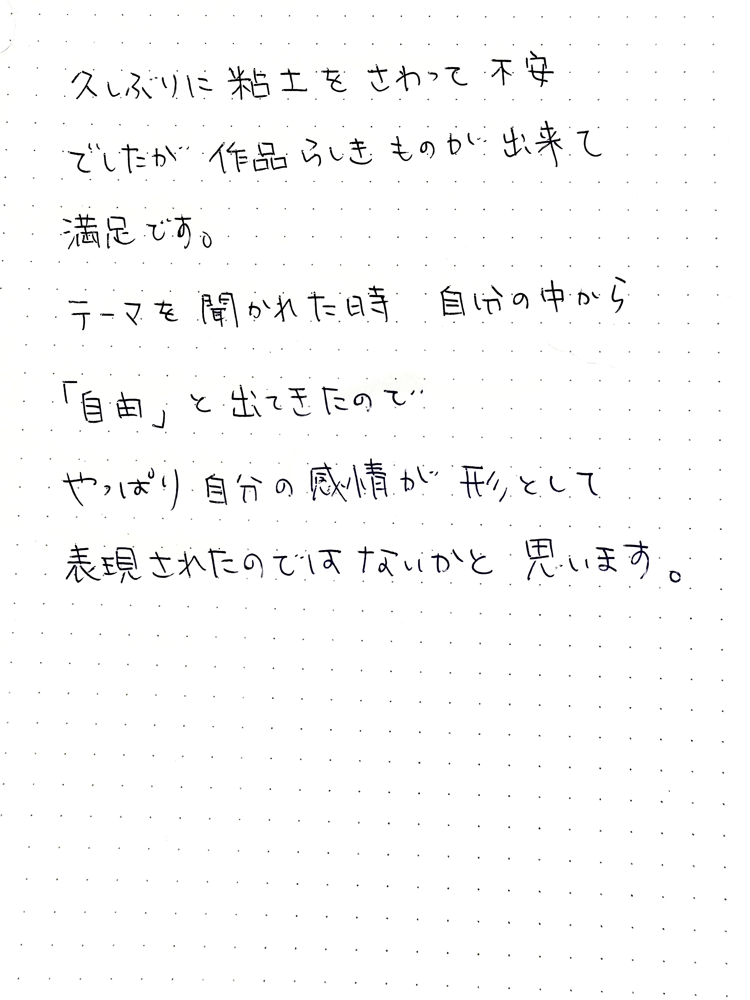
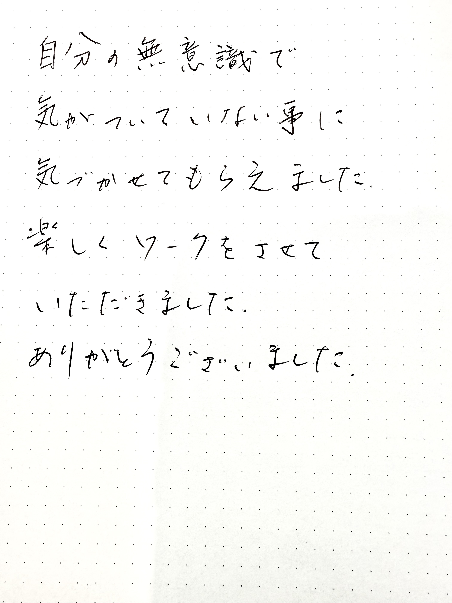

### 🔮 造り、眺めることで覚醒へ
このプログラムでは、「粘土遊び」をして作品を1つ作ることで創造性を働かせ自分を解放し、思考の枠組みを超えた覚醒への道筋を作ってゆきます。

完成した作品と向き合うことで自分の内面を見つめ、気づきを得る。

その気づきにより、潜在意識に作られたブロックが外れてゆきます。

粘土をこねて形づくる日と、形づくった粘土に色を塗る日の2日間で、1つの作品を完成させます。

小さい頃は粘土と触れ合う機会があっても、自分が成長するに従ってそういう遊びを忘れてしまうもの。

このプログラムでは、幼い頃の「無垢な自分」を取り戻し、ただ手の動くままに作品を作ることで「無心」の状態になり、魂の覚醒に至るよう、誘導してゆきます。

出来上がった作品は、あなたの内面の表れです。

鑑賞してどんな事を感じるか、何に気付いたかをシェアして頂きます。

気付く事によってブロックが外れ、本来のあなたへまた一歩近付きます。

### 🧘 ハイアーセルフと繋がる
「うまく作らなければ」「こんな変なのを作って恥ずかしい」などの気持ちは全部忘れて頂きます。

粘土遊びの前に、自分の「殻」を破り高次の存在と繋がりやすくするためにボディワークを行なっていただきます。

ボディワークの後、誘導瞑想にて実際に自分のハイヤーセルフと繋がり、メッセージを得ていただきます。

ハイヤーセルフと繋がり、自分のありのままの本音をさらけ出せるようなボディとマインドの準備を整えてから粘土遊びに入ってゆきます。

---

<!-- コンバージョンボタンエリア -->

  <a href="https://forms.gle/Uf1iazz1dmR691yh9" target="_blank" rel="noopener noreferrer" class="btn-action btn-apply">
    お申し込みはこちら
  </a>
  <a href="https://forms.gle/S4YanYgGCeFCjhqr8" target="_blank" rel="noopener noreferrer" class="btn-action btn-contact">
    お問い合わせはこちら
  </a>

---
### 💬 受講生の声

---

### ✨ クレイワーク・プログラムを受けるメリット

* **本来の自分へ回帰**：回数を重ねるほどに「自分を覆っている殻」が外れてゆき、思考を超えた無垢な自分に戻りやすくなります。
* **ブロックの解放**：誰もが無数に持っている潜在意識のブロックが少しずつ外れ、本来の自分へと戻ってゆく事ができます。
* **覚醒状態の定着**：毎回、覚醒体験を繰り返す事で覚醒の状態を定着させることができます。
* **現実創造の加速**：顕在意識と潜在意識のズレが無くなってくるため、願望なども叶いやすくなります。
* **ブレない自分軸**：思考を介さない表現を重ねる事で右脳優位な状態を保つため、ありのままの自分で生きる事ができ、悩み事や心配事に振り回される事が無くなってきます。
* **チャネリング能力の向上**：毎回ハイヤーセルフと繋がるワークを行いますので、チャネリングの能力も身についてきます。

---

### 📅 スケジュール
※参加人数により、時間に増減あり

#### 【1日目】（約1時間45分）
1. **ボディワーク・誘導瞑想**（約40分）
2. **粘土遊び**（約45分）
3. **シェア**（約20分）

#### 【2日目】（約1時間45分）
1. **ボディワーク・誘導瞑想**（約40分）
2. **色塗り**（約45分）
3. **シェア**（約20分）

---

### 🎨 あらかじめご用意いただくもの
※汚れてもよい服装でご参加ください。
 
※下記はすべて100円ショップで揃います。

* **必須のもの**
  * 紙粘土 2つ
  * 絵の具セット
  * 筆（平筆と細筆）
* **代用がきくもの**
  * へら（割り箸や竹串などでOK）
  * 粘土マット（段ボールなどでOK）
  * 水入れ（紙コップ1つ分ぐらい）
  * ぞうきん

---

### 💳 料金（税込）
※材料費別

#### ◆ 1回（オンライン）
* **2日間**：通常価格　28,000円

#### ◆ 半年コース（オンライン）
* **2日間 × 6回**：通常価格　150,000円（一括払い）

お支払い方法：銀行振込、PayPay

> 💡 **対面開催をご希望の方へ**
> ご要望により対面での開催も可能です。まずはお気軽にお問い合わせください。

---

<!-- コンバージョンボタンエリア -->

  <a href="https://forms.gle/Uf1iazz1dmR691yh9" target="_blank" rel="noopener noreferrer" class="btn-action btn-apply">
    お申し込みはこちら
  </a>
  <a href="https://forms.gle/S4YanYgGCeFCjhqr8" target="_blank" rel="noopener noreferrer" class="btn-action btn-contact">
    お問い合わせはこちら
  </a>

---

